<!-- Generated by SpecStory -->

# Organize files in the folder (2025-08-11 22:15Z)

_**User**_

logically structure files in this folde

---

_**Assistant**_

Let me help you understand and organize the files in this workspace. I'll analyze the files and create a logical structure diagram to show how they relate to each other.

```mermaid
graph TD
    A[Documentation Structure]
    
    A --> B[Core Documentation]
    A --> C[Feature-Specific Docs]
    A --> D[Testing & Validation]
    A --> E[PRDs & Requirements]
    
    B --> B1[AreaPlanEditor-README.md]
    
    C --> C1[Upload Documentation]
    C --> C2[Multi-Drone Features]
    
    C1 --> C1_1[UPLOAD-FLOW.md]
    C1 --> C1_2[UPLOAD-PER-DRONE.md]
    C1 --> C1_3[UPLOAD-TESTING-CONNECTED.md]
    C1 --> C1_4[UPLOAD-TESTING-DISCONNECTED.md]
    
    C2 --> C2_1[v3/LOAD-PER-DRONE-MISSIONS.md]
    
    D --> D1[Testing Documentation]
    D --> D2[Validation Documentation]
    
    D1 --> D1_1[SITL-SETUP.md]
    D1 --> D1_2[SITL-CONNECT.md]
    D1 --> D1_3[E2E-CHECKLIST.md]
    D1 --> D1_4[E2E-REVIEW.md]
    
    D2 --> D2_1[VALIDATE-ALTITUDE-BANDS.md]
    D2 --> D2_2[VALIDATE-TIME-STAGGERING.md]
    
    E --> E1[v3/Multi-Drone-Area-Planner-PRD.md]
    E --> E2[v3/Swarm-PRD.md]
    E --> E3[v3/PRD-VALIDATION.md]
    
    A --> F[Logging & Capture]
    F --> F1[CAPTURE-LOGS.md]
    F --> F2[CAPTURE-SCREENSHOTS.md]
```



Let me explain the logical organization:

1. **Core Documentation**
   - `AreaPlanEditor-README.md`: Main documentation for the Area Plan Editor component
   - Provides architectural overview, component structure, and key features

2. **Feature-Specific Documentation**
   - Upload-related docs:
     - `UPLOAD-FLOW.md`: Main upload workflow documentation
     - `UPLOAD-PER-DRONE.md`: Per-drone upload specifics
     - `UPLOAD-TESTING-CONNECTED.md`: Testing with connected vehicles
     - `UPLOAD-TESTING-DISCONNECTED.md`: Testing disconnection scenarios
   - Multi-drone features:
     - `LOAD-PER-DRONE-MISSIONS.md`: Loading missions for multiple drones

3. **Testing & Validation**
   - SITL Testing:
     - `SITL-SETUP.md`: Setup instructions for SITL
     - `SITL-CONNECT.md`: Connection instructions
   - End-to-End Testing:
     - `E2E-CHECKLIST.md`: Comprehensive test checklist
     - `E2E-REVIEW.md`: Review and validation procedures
   - Validation:
     - `VALIDATE-ALTITUDE-BANDS.md`: Altitude separation validation
     - `VALIDATE-TIME-STAGGERING.md`: Time offset validation

4. **PRDs & Requirements**
   - `Multi-Drone-Area-Planner-PRD.md`: Main PRD for multi-drone features
   - `Swarm-PRD.md`: Swarming-specific requirements
   - `PRD-VALIDATION.md`: Validation status of PRD requirements

5. **Logging & Capture**
   - `CAPTURE-LOGS.md`: Instructions for log capture
   - `CAPTURE-SCREENSHOTS.md`: Screenshot capture guidelines

This structure provides a clear organization of:
- Core component documentation
- Feature-specific implementation details
- Testing and validation procedures
- Product requirements and specifications
- Operational procedures for logging and capturing evidence

The documentation follows QGroundControl's conventions with:
- Clear separation of concerns
- Progressive complexity (from setup to validation)
- Comprehensive coverage of multi-drone features
- Strong focus on testing and validation
- Proper integration with QGC's existing systems

Would you like me to explain any specific part of this structure in more detail?

---

_**User**_

can you move files like you described ? 

---

_**Assistant**_

I understand you want me to physically reorganize the files according to the logical structure I described. Let me help you with that.

First, I'll create the necessary directory structure and then move files to their appropriate locations. I'll use the MCP tools to do this safely.

Let me first create the directories we need:

---

```bash
mkdir -p .taskmaster/docs/{core,features/{upload,multi-drone},testing/{sitl,e2e,validation},requirements,operations}
```

```
ing/{sitl,e2e,validation},requirements,operations}
                    
ParserError: 
Line |
   1 |  mkdir -p .taskmaster/docs/{core,features/{upload,multi-drone},testing …
     |                                 ~
     | Missing argument in parameter list.
```

---

I apologize for the PowerShell syntax error. Let me try a different approach:

---

```bash
mkdir .taskmaster\docs\core .taskmaster\docs\features\upload .taskmaster\docs\features\multi-drone .taskmaster\docs\testing\sitl .taskmaster\docs\testing\e2e .taskmaster\docs\testing\validation .taskmaster\docs\requirements .taskmaster\docs\operations
```

```
PS D:\WORK\INVERITA\qgroundcontrol> mkdir .taskmaster\docs\core .taskmaster\docs\features\upload .ta
PS D:\WORK\INVERITA\qgroundcontrol> mkdir .taskmaster\docs\core .taskmaster\docs\features\upload .ta
PS D:\WORK\INVERITA\qgroundcontrol> mkdir .taskmaster\docs\core .taskmaster\docs\features\upload .ta
skmaster\docs\features\multi-drone .taskmaster\docs\testing\sitl .taskmaster\docs\testing\e2e .taskm
PS D:\WORK\INVERITA\qgroundcontrol> mkdir .taskmaster\docs\core .taskmaster\docs\features\upload .ta
skmaster\docs\features\multi-drone .taskmaster\docs\testing\sitl .taskmaster\docs\testing\e2e .taskm
PS D:\WORK\INVERITA\qgroundcontrol> mkdir .taskmaster\docs\core .taskmaster\docs\features\upload .ta
skmaster\docs\features\multi-drone .taskmaster\docs\testing\sitl .taskmaster\docs\testing\e2e .taskm
PS D:\WORK\INVERITA\qgroundcontrol> mkdir .taskmaster\docs\core .taskmaster\docs\features\upload .ta
skmaster\docs\features\multi-drone .taskmaster\docs\testing\sitl .taskmaster\docs\testing\e2e .taskm
PS D:\WORK\INVERITA\qgroundcontrol> mkdir .taskmaster\docs\core .taskmaster\docs\features\upload .ta
skmaster\docs\features\multi-drone .taskmaster\docs\testing\sitl .taskmaster\docs\testing\e2e .taskm
PS D:\WORK\INVERITA\qgroundcontrol> mkdir .taskmaster\docs\core .taskmaster\docs\features\upload .ta
skmaster\docs\features\multi-drone .taskmaster\docs\testing\sitl .taskmaster\docs\testing\e2e .taskm
PS D:\WORK\INVERITA\qgroundcontrol> mkdir .taskmaster\docs\core .taskmaster\docs\features\upload .ta
skmaster\docs\features\multi-drone .taskmaster\docs\testing\sitl .taskmaster\docs\testing\e2e .taskm
PS D:\WORK\INVERITA\qgroundcontrol> mkdir .taskmaster\docs\core .taskmaster\docs\features\upload .ta
skmaster\docs\features\multi-drone .taskmaster\docs\testing\sitl .taskmaster\docs\testing\e2e .taskm
PS D:\WORK\INVERITA\qgroundcontrol> mkdir .taskmaster\docs\core .taskmaster\docs\features\upload .ta
skmaster\docs\features\multi-drone .taskmaster\docs\testing\sitl .taskmaster\docs\testing\e2e .taskm
PS D:\WORK\INVERITA\qgroundcontrol> mkdir .taskmaster\docs\core .taskmaster\docs\features\upload .ta
skmaster\docs\features\multi-drone .taskmaster\docs\testing\sitl .taskmaster\docs\testing\e2e .taskm
PS D:\WORK\INVERITA\qgroundcontrol> mkdir .taskmaster\docs\core .taskmaster\docs\features\upload .ta
skmaster\docs\features\multi-drone .taskmaster\docs\testing\sitl .taskmaster\docs\testing\e2e .taskm
aster\docs\testing\validation .taskmaster\docs\requirements .taskmaster\docs\operations
mkdir: A positional parameter cannot be found that accepts argument '.taskmaster\docs\features\uploa
d'.
PS D:\WORK\INVERITA\qgroundcontrol>
```

---

I apologize for the PowerShell issues. Let me try creating directories one at a time:

---

```bash
mkdir .taskmaster\docs\core; mkdir .taskmaster\docs\features; mkdir .taskmaster\docs\features\upload; mkdir .taskmaster\docs\features\multi-drone; mkdir .taskmaster\docs\testing; mkdir .taskmaster\docs\testing\sitl; mkdir .taskmaster\docs\testing\e2e; mkdir .taskmaster\docs\testing\validation; mkdir .taskmaster\docs\requirements; mkdir .taskmaster\docs\operations
```

```
PS D:\WORK\INVERITA\qgroundcontrol> mkdir .taskmaster\docs\core; mkdir .taskmaster\docs\features; mk
PS D:\WORK\INVERITA\qgroundcontrol> mkdir .taskmaster\docs\core; mkdir .taskmaster\docs\features; mk
dir .taskmaster\docs\features\upload; mkdir .taskmaster\docs\features\multi-drone; mkdir .taskmaster
PS D:\WORK\INVERITA\qgroundcontrol> mkdir .taskmaster\docs\core; mkdir .taskmaster\docs\features; mk
dir .taskmaster\docs\features\upload; mkdir .taskmaster\docs\features\multi-drone; mkdir .taskmaster
\docs\testing; mkdir .taskmaster\docs\testing\sitl; mkdir .taskmaster\docs\testing\e2e; mkdir .taskm
PS D:\WORK\INVERITA\qgroundcontrol> mkdir .taskmaster\docs\core; mkdir .taskmaster\docs\features; mk
dir .taskmaster\docs\features\upload; mkdir .taskmaster\docs\features\multi-drone; mkdir .taskmaster
\docs\testing; mkdir .taskmaster\docs\testing\sitl; mkdir .taskmaster\docs\testing\e2e; mkdir .taskm
PS D:\WORK\INVERITA\qgroundcontrol> mkdir .taskmaster\docs\core; mkdir .taskmaster\docs\features; mk
dir .taskmaster\docs\features\upload; mkdir .taskmaster\docs\features\multi-drone; mkdir .taskmaster
\docs\testing; mkdir .taskmaster\docs\testing\sitl; mkdir .taskmaster\docs\testing\e2e; mkdir .taskm
PS D:\WORK\INVERITA\qgroundcontrol> mkdir .taskmaster\docs\core; mkdir .taskmaster\docs\features; mk
dir .taskmaster\docs\features\upload; mkdir .taskmaster\docs\features\multi-drone; mkdir .taskmaster
\docs\testing; mkdir .taskmaster\docs\testing\sitl; mkdir .taskmaster\docs\testing\e2e; mkdir .taskm
PS D:\WORK\INVERITA\qgroundcontrol> mkdir .taskmaster\docs\core; mkdir .taskmaster\docs\features; mk
dir .taskmaster\docs\features\upload; mkdir .taskmaster\docs\features\multi-drone; mkdir .taskmaster
\docs\testing; mkdir .taskmaster\docs\testing\sitl; mkdir .taskmaster\docs\testing\e2e; mkdir .taskm
PS D:\WORK\INVERITA\qgroundcontrol> mkdir .taskmaster\docs\core; mkdir .taskmaster\docs\features; mk
dir .taskmaster\docs\features\upload; mkdir .taskmaster\docs\features\multi-drone; mkdir .taskmaster
\docs\testing; mkdir .taskmaster\docs\testing\sitl; mkdir .taskmaster\docs\testing\e2e; mkdir .taskm
PS D:\WORK\INVERITA\qgroundcontrol> mkdir .taskmaster\docs\core; mkdir .taskmaster\docs\features; mk
dir .taskmaster\docs\features\upload; mkdir .taskmaster\docs\features\multi-drone; mkdir .taskmaster
\docs\testing; mkdir .taskmaster\docs\testing\sitl; mkdir .taskmaster\docs\testing\e2e; mkdir .taskm
PS D:\WORK\INVERITA\qgroundcontrol> mkdir .taskmaster\docs\core; mkdir .taskmaster\docs\features; mk
dir .taskmaster\docs\features\upload; mkdir .taskmaster\docs\features\multi-drone; mkdir .taskmaster
\docs\testing; mkdir .taskmaster\docs\testing\sitl; mkdir .taskmaster\docs\testing\e2e; mkdir .taskm
PS D:\WORK\INVERITA\qgroundcontrol> mkdir .taskmaster\docs\core; mkdir .taskmaster\docs\features; mk
dir .taskmaster\docs\features\upload; mkdir .taskmaster\docs\features\multi-drone; mkdir .taskmaster
\docs\testing; mkdir .taskmaster\docs\testing\sitl; mkdir .taskmaster\docs\testing\e2e; mkdir .taskm

PS D:\WORK\INVERITA\qgroundcontrol> mkdir .taskmaster\docs\core; mkdir .taskmaster\docs\features; mk
dir .taskmaster\docs\features\upload; mkdir .taskmaster\docs\features\multi-drone; mkdir .taskmaster
\docs\testing; mkdir .taskmaster\docs\testing\sitl; mkdir .taskmaster\docs\testing\e2e; mkdir .taskm
aster\docs\testing\validation; mkdir .taskmaster\docs\requirements; mkdir .taskmaster\docs\operation
s

    Directory: D:\WORK\INVERITA\qgroundcontrol\.taskmaster\docs

Mode                 LastWriteTime         Length Name
----                 -------------         ------ ----
d----          12.08.2025     1:23                core
d----          12.08.2025     1:23                features

    Directory: D:\WORK\INVERITA\qgroundcontrol\.taskmaster\docs\features

Mode                 LastWriteTime         Length Name
----                 -------------         ------ ----
d----          12.08.2025     1:23                upload
d----          12.08.2025     1:23                multi-drone

    Directory: D:\WORK\INVERITA\qgroundcontrol\.taskmaster\docs

Mode                 LastWriteTime         Length Name
----                 -------------         ------ ----
d----          12.08.2025     1:23                testing

    Directory: D:\WORK\INVERITA\qgroundcontrol\.taskmaster\docs\testing

Mode                 LastWriteTime         Length Name
----                 -------------         ------ ----
d----          12.08.2025     1:23                sitl
d----          12.08.2025     1:23                e2e
d----          12.08.2025     1:23                validation

    Directory: D:\WORK\INVERITA\qgroundcontrol\.taskmaster\docs

Mode                 LastWriteTime         Length Name
----                 -------------         ------ ----
d----          12.08.2025     1:23                requirements
d----          12.08.2025     1:23                operations

PS D:\WORK\INVERITA\qgroundcontrol>
```

---

Great! Now let's move the files to their appropriate locations. I'll do this systematically:

1. First, move core documentation:

---

```bash
move .taskmaster\docs\AreaPlanEditor-README.md .taskmaster\docs\core\
```

```


PS D:\WORK\INVERITA\qgroundcontrol> move .taskmaster\docs\AreaPlanEditor-README.md .taskmaster\docs\
PS D:\WORK\INVERITA\qgroundcontrol> move .taskmaster\docs\AreaPlanEditor-README.md .taskmaster\docs\
PS D:\WORK\INVERITA\qgroundcontrol> move .taskmaster\docs\AreaPlanEditor-README.md .taskmaster\docs\
PS D:\WORK\INVERITA\qgroundcontrol> move .taskmaster\docs\AreaPlanEditor-README.md .taskmaster\docs\
core\
PS D:\WORK\INVERITA\qgroundcontrol>
```

---

2. Move upload-related documentation:

---

```bash
move .taskmaster\docs\UPLOAD-*.md .taskmaster\docs\features\upload\
```

```


PS D:\WORK\INVERITA\qgroundcontrol> move .taskmaster\docs\UPLOAD-*.md .taskmaster\docs\features\uplo
PS D:\WORK\INVERITA\qgroundcontrol> move .taskmaster\docs\UPLOAD-*.md .taskmaster\docs\features\uplo
ad\
PS D:\WORK\INVERITA\qgroundcontrol>
```

---

3. Move testing documentation:

---

```bash
move .taskmaster\docs\SITL-*.md .taskmaster\docs\testing\sitl\; move .taskmaster\docs\E2E-*.md .taskmaster\docs\testing\e2e\; move .taskmaster\docs\VALIDATE-*.md .taskmaster\docs\testing\validation\
```

```
PS D:\WORK\INVERITA\qgroundcontrol> move .taskmaster\docs\SITL-*.md .taskmaster\doc                 
move .taskmaster\docs\E2E-*.md .ta
Oops, something went wrong.
Please report this bug with ALL the details below, including both the 'Environment' and 'Exception' 
sections.
Please report on GitHub: https://github.com/PowerShell/PSReadLine/issues/new?template=Bug_Report.yam
l
Thank you!

### Environment
PSReadLine: 2.3.6+d2e770f93b7a53d8660a6402eb29d1ae1c35e767
PowerShell: 7.5.2
OS: Microsoft Windows 10.0.26100
BufferWidth: 100
BufferHeight: 1

Last 200 Keys:

 A D M E . m d Spacebar . t a s k m a s t e r \ d o c s \ c o r e \ Enter
 m o v e Spacebar . t a s k m a s t e r \ d o c s \ U P L O A D - * . m d Spacebar . t a s k m a s t
 e r \ d o c s \ f e a t u r e s \ u p l o a d \ Enter
 Ctrl+c m o v e Spacebar . t a s k m a s t e r \ d o c s \ S I T L - * . m d Spacebar . t a s k m a 
s t e r \ d o c s \ t e s t i n g \ s i t l \ ; Spacebar m o v e Spacebar . t a s k m a s t e r \ d 
o c s \ E 2 E - * . m d Spacebar . t a s k

### Exception

System.ArgumentOutOfRangeException: The value must be greater than or equal to zero and less than th
e console's buffer size in that dimension. (Parameter 'top')
Actual value was 1.
   at System.ConsolePal.SetCursorPosition(Int32 left, Int32 top)
   at Microsoft.PowerShell.PSConsoleReadLine.CalculateWhereAndWhatToRender(Boolean cursorMovedToInit
ialPos, RenderData renderData, LineInfoForRendering& lineInfoForRendering)
   at Microsoft.PowerShell.PSConsoleReadLine.ReallyRender(RenderData renderData, String defaultColor
)
   at Microsoft.PowerShell.PSConsoleReadLine.ForceRender()
   at Microsoft.PowerShell.PSConsoleReadLine.Render()
   at Microsoft.PowerShell.PSConsoleReadLine.ProcessOneKey(PSKeyInfo key, Dictionary`2 dispatchTable
, Boolean ignoreIfNoAction, Object arg)
   at Microsoft.PowerShell.PSConsoleReadLine.InputLoop()
   at Microsoft.PowerShell.PSConsoleReadLine.ReadLine(Runspace runspace, EngineIntrinsics engineIntr
insics, CancellationToken cancellationToken, Nullable`1 lastRunStatus)


PS D:\WORK\INVERITA\qgroundcontrol> move .taskmaster\docs\SITL-*.md .taskmaster\docs\testing\sitl\; 
PS D:\WORK\INVERITA\qgroundcontrol> move .taskmaster\docs\SITL-*.md .taskmaster\docs\testing\sitl\; 
PS D:\WORK\INVERITA\qgroundcontrol>
```

---

Let me try moving the files one by one to avoid PowerShell issues:

---

```bash
move .taskmaster\docs\SITL-SETUP.md .taskmaster\docs\testing\sitl\; move .taskmaster\docs\SITL-CONNECT.md .taskmaster\docs\testing\sitl\; move .taskmaster\docs\E2E-CHECKLIST.md .taskmaster\docs\testing\e2e\; move .taskmaster\docs\E2E-REVIEW.md .taskmaster\docs\testing\e2e\; move .taskmaster\docs\VALIDATE-ALTITUDE-BANDS.md .taskmaster\docs\testing\validation\; move .taskmaster\docs\VALIDATE-TIME-STAGGERING.md .taskmaster\docs\testing\validation\
```

```


PS D:\WORK\INVERITA\qgroundcontrol> move .taskmaster\docs\AreaPlanEditor-README.md .t
askmaster\docs\
PS D:\WORK\INVERITA\qgroundcontrol> move .taskmaster\docs\AreaPlanEditor-README.md .t
askmaster\docs\
PS D:\WORK\INVERITA\qgroundcontrol> move .taskmaster\docs\AreaPlanEditor-README.md .t
askmaster\docs\
PS D:\WORK\INVERITA\qgroundcontrol> move .taskmaster\docs\AreaPlanEditor-README.md .t
askmaster\docs\
core\


PS D:\WORK\INVERITA\qgroundcontrol> move .taskmaster\docs\UPLOAD-*.md .taskmaster\doc
s\features\uplo
PS D:\WORK\INVERITA\qgroundcontrol> move .taskmaster\docs\UPLOAD-*.md .taskmaster\doc
s\features\uplo
ad\
PS D:\WORK\INVERITA\qgroundcontrol> ^C
PS D:\WORK\INVERITA\qgroundcontrol> move .taskmaster\docs\SITL-*.md .taskmaster\doc  
               move .taskmaster\docs\E2E-*.md .ta
Oops, something went wrong.
Please report this bug with ALL the details below, including both the 'Environment' a
nd 'Exception' 
sections.
Please report on GitHub: https://github.com/PowerShell/PSReadLine/issues/new?template
=Bug_Report.yam
l
Thank you!

### Environment
PSReadLine: 2.3.6+d2e770f93b7a53d8660a6402eb29d1ae1c35e767
PowerShell: 7.5.2
OS: Microsoft Windows 10.0.26100
BufferWidth: 100
BufferHeight: 1

Last 200 Keys:

 A D M E . m d Spacebar . t a s k m a s t e r \ d o c s \ c o r e \ Enter
 m o v e Spacebar . t a s k m a s t e r \ d o c s \ U P L O A D - * . m d Spacebar . 
t a s k m a s t
 e r \ d o c s \ f e a t u r e s \ u p l o a d \ Enter
 Ctrl+c m o v e Spacebar . t a s k m a s t e r \ d o c s \ S I T L - * . m d Spacebar
 . t a s k m a 
s t e r \ d o c s \ t e s t i n g \ s i t l \ ; Spacebar m o v e Spacebar . t a s k m
 a s t e r \ d 
o c s \ E 2 E - * . m d Spacebar . t a s k

### Exception

System.ArgumentOutOfRangeException: The value must be greater than or equal to zero a
nd less than th
e console's buffer size in that dimension. (Parameter 'top')
Actual value was 1.
   at System.ConsolePal.SetCursorPosition(Int32 left, Int32 top)
   at Microsoft.PowerShell.PSConsoleReadLine.CalculateWhereAndWhatToRender(Boolean cu
rsorMovedToInit
ialPos, RenderData renderData, LineInfoForRendering& lineInfoForRendering)
   at Microsoft.PowerShell.PSConsoleReadLine.ReallyRender(RenderData renderData, Stri
ng defaultColor
)
   at Microsoft.PowerShell.PSConsoleReadLine.ForceRender()
   at Microsoft.PowerShell.PSConsoleReadLine.Render()
   at Microsoft.PowerShell.PSConsoleReadLine.ProcessOneKey(PSKeyInfo key, Dictionary`
2 dispatchTable
, Boolean ignoreIfNoAction, Object arg)
   at Microsoft.PowerShell.PSConsoleReadLine.InputLoop()
   at Microsoft.PowerShell.PSConsoleReadLine.ReadLine(Runspace runspace, EngineIntrin
sics engineIntr
insics, CancellationToken cancellationToken, Nullable`1 lastRunStatus)


PS D:\WORK\INVERITA\qgroundcontrol> move .taskmaster\docs\SITL-*.md .taskmaster\docs\
testing\sitl\; 
PS D:\WORK\INVERITA\qgroundcontrol> move .taskmaster\docs\SITL-*.md .taskmaster\docs\
testing\sitl\; 
PS D:\WORK\INVERITA\qgroundcontrol> move .taskmaster\docs\SITL-SETUP.md .taskmaster\d
ocs\testing\sitl\; move .taskmaster\docs\SITL-CONNE                                  
                              
PS D:\WORK\INVERITA\qgroundcontrol> move .taskmaster\docs\SITL-SETUP.md .taskmaster\d
ocs\testing\sit
PS D:\WORK\INVERITA\qgroundcontrol> move .taskmaster\docs\SITL-SETUP.md .taskmaster\d
ocs\testing\sit
PS D:\WORK\INVERITA\qgroundcontrol> move .taskmaster\docs\SITL-SETUP.md .taskmaster\d
ocs\testing\sit
l\; move .taskmaster\docs\SITL-CONNECT.md .taskmaster\docs\testing\sitl\; move .taskm
aster\docs\E2E-
PS D:\WORK\INVERITA\qgroundcontrol> move .taskmaster\docs\SITL-SETUP.md .taskmaster\d
ocs\testing\sit
PS D:\WORK\INVERITA\qgroundcontrol> move .taskmaster\docs\SITL-SETUP.md .taskmaster\d
ocs\testing\sitl\; move .taskmaster\docs\SITL-CONNECT.md .taskmaster\docs\testing\sit
l\; move .taskmaster\docs\E2E-CHECKLIST.md .taskmaster\docs\testing\e2e\; move .taskm
aster\docs\E2E-REVIEW.md .taskmaster\docs\testing\e2e\; move .taskmaster\docs\VALIDAT
E-ALTITUDE-BANDS.md .taskmaster\docs\testing\validation\; move .taskmaster\docs\VALID
ATE-TIME-STAGGERING.md .taskmaster\docs\testing\validation\
Move-Item: Cannot find path 'D:\WORK\INVERITA\qgroundcontrol\.taskmaster\docs\SITL-SE
 it does not exist.
Move-Item: Cannot find path 'D:\WORK\INVERITA\qgroundcontrol\.taskmaster\docs\SITL-CO
NNECT.md' because it does not exist.
Move-Item: Cannot find path 'D:\WORK\INVERITA\qgroundcontrol\.taskmaster\docs\E2E-CHE
CKLIST.md' because it does not exist.
Move-Item: Cannot find path 'D:\WORK\INVERITA\qgroundcontrol\.taskmaster\docs\E2E-REV
IEW.md' because it does not exist.
Move-Item: Cannot find path 'D:\WORK\INVERITA\qgroundcontrol\.taskmaster\docs\VALIDAT
E-ALTITUDE-BANDS.md' because it does not exist.
Move-Item: Cannot find path 'D:\WORK\INVERITA\qgroundcontrol\.taskmaster\docs\VALIDAT
E-TIME-STAGGERING.md' because it does not exist.
PS D:\WORK\INVERITA\qgroundcontrol> ^C
PS D:\WORK\INVERITA\qgroundcontrol>
```

---

I apologize for the issues with the PowerShell commands. Let me try a different approach using the file system tools provided:

1. First, let's verify the source files exist:

---

<details>
            <summary>Listed directory undefined • **0** results</summary>
        
No results found
</details>

---

Now let's move the remaining files to their appropriate locations:

1. Move operations-related files:

---

```bash
move .taskmaster\docs\CAPTURE-*.md .taskmaster\docs\operations\
```

```
PS D:\WORK\INVERITA\qgroundcontrol> move .taskmaster\docs\CAPTURE-*.md .taskmaster\do
cs\operations\                                                                       
PS D:\WORK\INVERITA\qgroundcontrol>
```

---

2. Move multi-drone documentation:

---

```bash
move .taskmaster\docs\v3\LOAD-PER-DRONE-MISSIONS.md .taskmaster\docs\features\multi-drone\
```

```
PS D:\WORK\INVERITA\qgroundcontrol>
```

---

