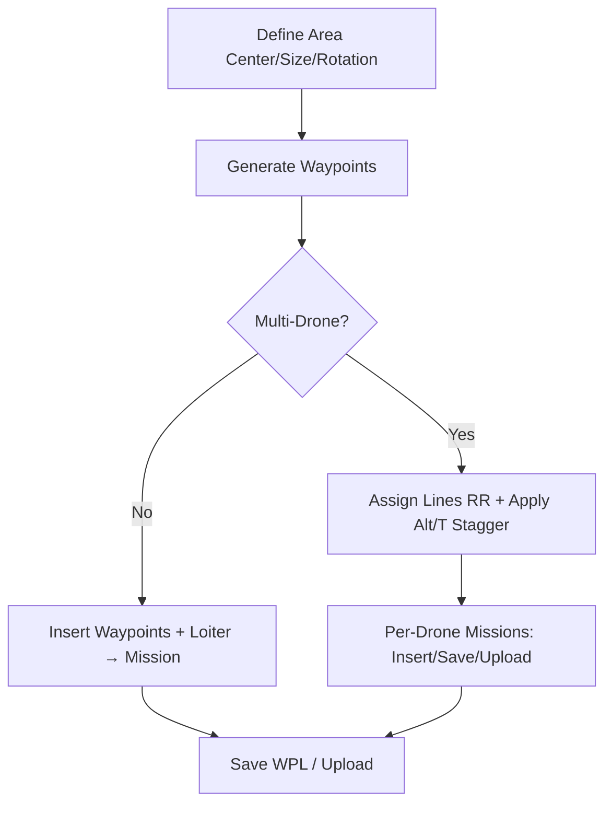

# Multi‑Drone Area Planner PRD (QGroundControl)

This PRD is derived from the template in `.taskmaster/templates/example_prd.txt` and informed by swarming guidance in `mvp/swarming/README.md`. It appends a Current State section summarizing the live implementation across `AreaPlanEditor.qml`, `AreaPlanMapVisuals.qml`, `AreaPlanEditor.h`, `AreaPlanEditor.cc`, and inventories for `docs/` and `mvp/`.

## Overview
- **Problem**: Efficiently plan and execute coverage missions over a rectangular area using one or many vehicles, ensuring deconfliction (altitude banding, time staggering) and repeatable outputs (WPL files, uploads).
- **Audience**: Field operators and integrators using QGroundControl (QGC) to validate multi‑drone planning and execution (including SITL).
- **Value**: Rapid “draw → generate → upload” workflow, multi‑vehicle assignment, and clear map visualization with robust QGC theming.

## Core Features
- **Interactive area definition** on map (center set/click‑drag, resizable, rotatable) with live overlays.
- **Mission generation** into QGC Mission Tab with optional loiter at each waypoint and RTL policies.
- **Multi‑drone planning**:
  - Round‑robin line assignment across drones
  - Altitude banding per drone (start, step)
  - Time staggering per drone (offset seconds)
  - Per‑drone mission insertion/upload and per‑drone WPL export
- **Per‑drone on‑map preview** overlay with visibility toggles and legend.
- **Vehicle selection** (active/mapped) and per‑drone upload sequencing.
- **Progress/status** surface with validation flows and descriptive errors.
- **Performance** knobs (simple caching, preview debounce) for smooth UI.

## User Experience
- Plan View panel labeled “Area Planning Mission Editor”.
- Steps:
  1) Activate Area Definition Mode and click to set area center; drag/click to size rectangle
  2) Enter area width/height, line spacing, and number of points
  3) Set mission altitude and optional loiter duration
  4) Generate waypoints to Mission Tab; optionally save WPL and/or upload
  5) Multi‑drone: set drone count, altitude banding, time offsets; preview per drone; insert/upload per‑drone missions or “Insert All/Upload All”
- QML uses QGC controls (`QGCPalette`, `ScreenTools`); no horizontal scrolling; sizes derived from font metrics.

## Technical Architecture
- **Frontend (QML)**:
  - `src/QmlControls/AreaPlanEditor.qml` UI, binds to backend properties, triggers actions; supports per‑drone UI and vehicle selection.
  - `src/QmlControls/AreaPlanMapVisuals.qml` draws rectangle, grid lines, waypoint markers, per‑drone overlays and legend; uses `QGCDynamicObjectManager`.
- **Backend (C++)**:
  - `src/QmlControls/AreaPlanEditor.h/.cc` `QML_ELEMENT` exposing Q_PROPERTY/Q_INVOKABLE API
  - Integrates with QGC `MissionController`, `MissionManager`, `Vehicle`, `MultiVehicleManager`
  - Waypoint generation with simple geodesic offset; mission assembly; file save (WPL 110); optional upload
  - Multi‑drone stripe/assignment helpers via `MissionManager/AreaPartition` (AreaPlan)
- **Data Shapes**:
  - Waypoints: `QVariantList` of `QGeoCoordinate`
  - Per‑drone preview: `[{ droneIndex, altitudeOffsetM, timeOffsetS, waypoints: [QGeoCoordinate] }]`
- **External/Test infra**:
  - SITL swarming: run multiple ArduPilot instances; route to QGC UDP 14550; MAVProxy optional.

## Development Roadmap
- **MVP (implemented)**:
  - Rectangle area definition; rotation; parameter validation; generate → mission; file save; upload (single and per‑drone); per‑drone preview & overlays; progress/status; QGC‑style UI.
- **Near‑term Enhancements**:
  - Map draw handles for resize/rotate; better drag affordances
  - Persist/restore parameter presets; finer loiter/RTL policies per stage
  - Stronger preview caching and diffing; throttle logs in production
- **Future Work**:
  - Polygonal areas; lawnmower pattern selection; terrain awareness
  - Coverage metrics and path optimization; inter‑vehicle conflict checks
  - Batch upload/monitor with success/failure rollup

## Logical Dependency Chain
1) UI bindable parameters and drawing mode
2) Rectangle/grid/waypoint math in local‑meters frame around `areaCenter` with rotation
3) Single‑drone waypoint generation → MissionController insertion (+loiter) → optional upload
4) Multi‑drone assignment (round‑robin lines) → per‑drone altitude/time offsets → per‑drone missions/files/uploads
5) Status/progress/error handling

## Risks and Mitigations
- Coordinate math accuracy and rotation: use geodesic offset and validate coordinates at each step; clamp/normalize rotation.
- Parameter validity (spacing, counts, altitude): central `validateInput` + `validateAreaParameters` with bounded ranges.
- QGC mission API coupling: guard for controller/vehicle availability; avoid accessing private methods when not required; provide fallbacks when serializing mission files.
- Multi‑vehicle mapping ambiguity: expose explicit mapping UI; default to active vehicle if unspecified.
- UI performance: debounce overlays; object reuse; optional caching; log throttling for production.

## Appendix
- Swarming quick summary: supports multiple SITL instances forwarding to QGC UDP 14550; use `--no-mavproxy` and `-A "--serial0=udpclient:127.0.0.1:14550"` or MAVProxy `output add 127.0.0.1:14550`. See `mvp/swarming/README.md`.

---

## Current State (Implementation Snapshot)

### `src/QmlControls/AreaPlanEditor.qml`
- Sections: Area Configuration, Interactive Drawing Controls, Movement & Rotation Controls, Mission Controls, Per‑Drone Vehicle Mapping, Mission Statistics & Preview, Status, Debug Tools.
- Per‑drone UI: set drone count, altitude band start/step, time offset; “Insert Drone #”, “Insert All”, “Save Per‑Drone Mission Files”; upload drone→vehicle (combo bound to `multiVehicleManager.vehicles`).
- Preview: `waypointPreview = areaPlanEditor.computePerDroneWaypointPreview()`; legend and counts shown.
- Uses `QGCPalette`, `ScreenTools`; avoids hardcoded sizes; diagnostic logging enabled.

### `src/QmlControls/AreaPlanMapVisuals.qml`
- Draws:
  - Rectangle `MapPolygon` for area (corner geodesic offsets with rotation)
  - Grid lines `MapPolyline` at `lineSpacing`
  - Waypoint markers `MapQuickItem`
  - Per‑drone overlays (colored markers) + legend toggles; debounce timer; object reuse to limit churn
- Reacts to property changes via `Connections`; rebuilds overlays/markers accordingly; visibility/opacity/interactive gates.

### `src/QmlControls/AreaPlanEditor.h`
- Properties: `areaWidth/Height`, `lineSpacing`, `numPoints`, `missionAltitude`, `areaCenter`, `homeLocation`, `areaRotation`, `loiterTime`.
- Multi‑drone: `droneCount`, `altitudeBandStart/Step`, `timeOffsetPerDrone`, `rtlAfterEveryWaypoint`, `loiterAfterRtl`.
- API: setters/movers/rotators, `generateWaypoints`, per‑drone preview/generation, `addPerDroneToMission`, `addAllDronesToMission`, `addWaypointsToMission`, `saveMissionFile`, `savePerDroneMissionFiles`, `uploadToVehicle`, `uploadPerDroneMissionToVehicle`, `startMission`.
- Helpers: `calculateOffsetCoordinate`, `validate*`, progress/status signals; simple caching & profiling.
- Defaults: area 10×10 m, spacing 10 m, altitude 10 m, 1 point/line, droneCount 2; center/home set to a default valid coordinate.

### `src/QmlControls/AreaPlanEditor.cc`
- Validation: `validateInput`, `validateAreaParameters` with bounds and coordinate checks.
- Movement/rotation: N/E/S/W by ~0.5 m; rotation normalized to [0,360).
- Waypoint gen: line count `floor(areaHeight/lineSpacing)`; line centers offset 180°, points along width at 90°; altitude set to mission altitude.
- Per‑drone preview/gen: round‑robin stripe assignment; altitude/time offsets; `AreaPlan::splitIntoStripes` and `assignStripesRoundRobin`.
- Mission build:
  - Single: removeAll → takeoff → waypoint + convert to `MAV_CMD_NAV_LOITER_TIME` (params set before `setCommand`) → RTL/Land
  - Per‑drone: optional staggered loiter at home; takeoff; waypoints (+optional RTL/loiter after each) → optional final RTL
  - Upload: `MissionManager::writeMissionItems` with progress/error hooks
  - File save: QGC WPL 110 serialization for single/per‑drone
- Progress/logging: start/update/finish/cancel with messages; metrics and cache stats.

---

## Repository Docs and MVP Inventories (for context)

### `docs/` (high‑level)
- Languages: `en/`, `ko/`, `tr/`, `zh/` with `qgc-user-guide` and `qgc-dev-guide` markdown sets and `SUMMARY.md` indexes.
- Assets: extensive image libraries for Analyze/Fly/Plan/Quickstart/Settings/Setup/etc.
- Public: favicon and QGC icon.

### `mvp/`
- `check-list.md`: task/validation notes
- `mission_area_planner_prd.md`: earlier PRD notes for the planner
- `missions-gui.py`: prototype GUI script
- `multi-drone-storm.md`, `mulri-drone-storm-tuned.md`: multi‑drone planning ideas/tuning
- `swarming/README.md`: SITL + MAVProxy + QGC multi‑vehicle runbook (core reference)
- `test_interactive_drawing.md`, `test_plan_interactive_drawing.md`: manual test flows

---

## Mermaid: High‑Level Flow

## Acceptance Criteria (MVP)
- Generate mission from rectangle with N lines × M points using configured altitude.
- Optional loiter time applied via `MAV_CMD_NAV_LOITER_TIME` at each point.
- Multi‑drone: round‑robin line groups with altitude banding and cumulative time offsets; per‑drone WPL files.
- Uploads succeed to active/selected vehicle with progress/errors surfaced.
- Map overlays reflect current parameters; per‑drone legend toggles visibility.
- All user‑facing text uses `qsTr()`, sizes via `ScreenTools`, colors via `QGCPalette`.

## Test Strategy (excerpt)
- Unit‑style validation via `validate*` methods for parameter bounds and waypoint counts.
- Manual SITL runs using `swarming/README.md` guidance; confirm multiple heartbeats and per‑drone uploads.
- Visual checks: rectangle corners rotate correctly; grid count == floor(H/spacing); marker counts match expectations; overlay toggles work.
