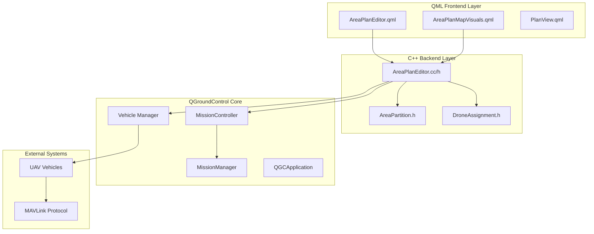
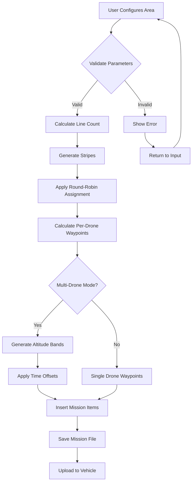
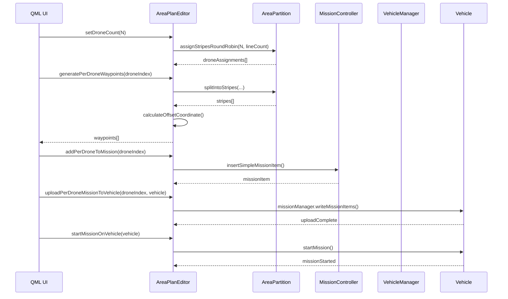
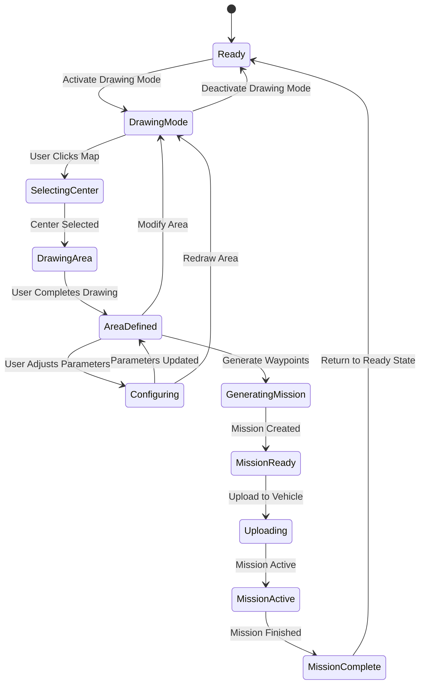
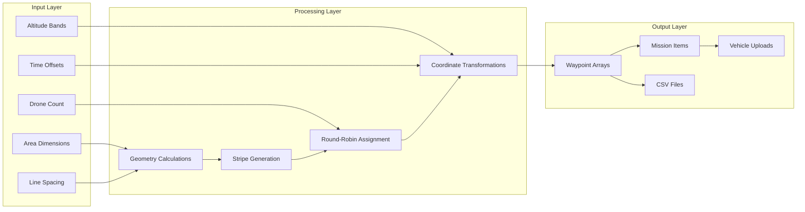
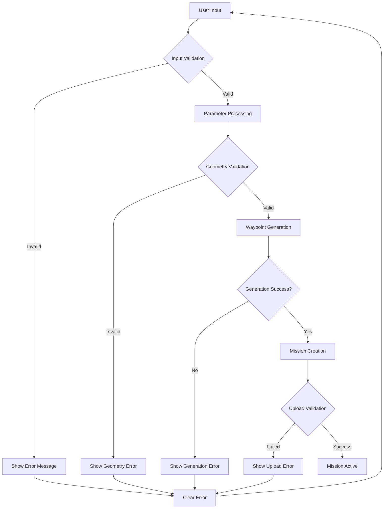
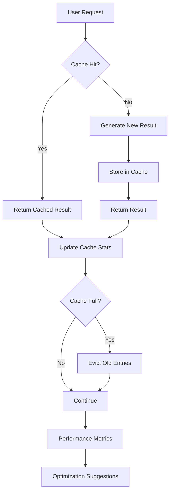
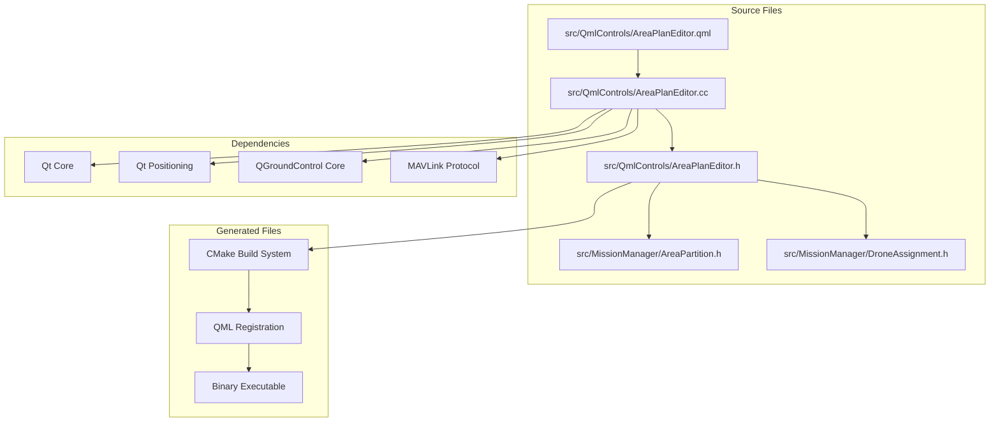
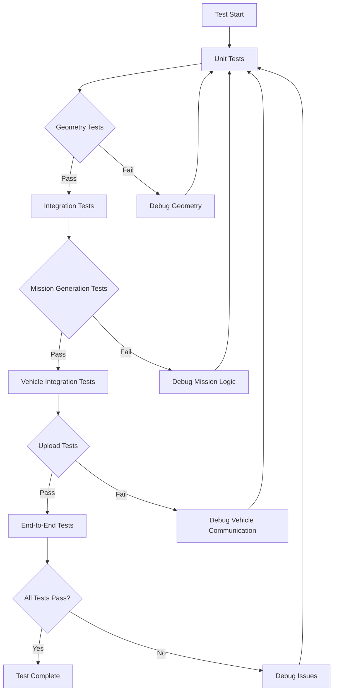

# Area Plan Editor - Comprehensive Architecture & Code Flow

## System Overview

This document provides a comprehensive visualization of the QGroundControl Area Plan Editor architecture using Mermaid diagrams. The system enables multi-drone area planning with interactive drawing, mission generation, and vehicle coordination.

## 1. High-Level System Architecture



## 2. Class Structure & Relationships

```mermaid
classDiagram
    class AreaPlanEditor {
        +QObject parent
        +qreal areaWidth
        +qreal areaHeight
        +qreal lineSpacing
        +int numPoints
        +qreal missionAltitude
        +int droneCount
        +QGeoCoordinate areaCenter
        +qreal areaRotation
        +generateWaypoints()
        +addWaypointsToMission()
        +uploadToVehicle()
        +setAreaWidth(qreal)
        +setAreaHeight(qreal)
        +setLineSpacing(qreal)
        +setNumPoints(int)
        +setMissionAltitude(qreal)
        +setAreaCenter(QGeoCoordinate)
        +setAreaRotation(qreal)
    }
    
    class AreaPartition {
        +struct Point { double x, y }
        +struct Line { Point a, b }
        +splitIntoStripes(cx, cy, width, height, stripeCount, alongShortAxis, rotationDeg)
        +assignStripesRoundRobin(droneCount, lineCount)
    }
    
    class DroneAssignment {
        +int droneIndex
        +double altitudeOffsetM
        +double timeOffsetS
        +vector<int> lineIndices
    }
    
    class MissionController {
        +insertSimpleMissionItem()
        +removeVisualItem()
        +sendToVehicle()
        +visualItems()
    }
    
    class Vehicle {
        +id()
        +coordinate()
        +armed()
        +flightMode()
        +missionManager()
        +setArmed(bool)
        +startMission()
        +guidedModeTakeoff()
    }
    
    AreaPlanEditor --> AreaPartition : uses
    AreaPlanEditor --> DroneAssignment : creates
    AreaPlanEditor --> MissionController : controls
    AreaPlanEditor --> Vehicle : manages
```

## 3. Mission Generation Flow



## 4. Multi-Drone Coordination Flow



## 5. Interactive Drawing System Flow



## 6. Data Flow Architecture



## 7. Error Handling & Validation Flow



## 8. Performance Optimization Flow



## 9. File Structure & Dependencies



## 10. Testing & Validation Flow



## Code References

### Key Functions in AreaPlanEditor.cc

- **`generateWaypoints()`** (Line 650): Core waypoint generation algorithm
- **`computePartitionStripes()`** (Line 700): Stripe calculation using AreaPartition
- **`computeRoundRobinAssignments()`** (Line 720): Drone assignment algorithm
- **`addPerDroneToMission()`** (Line 800): Mission insertion logic
- **`uploadPerDroneMissionToVehicle()`** (Line 900): Vehicle upload implementation

### Key Functions in AreaPartition.h

- **`splitIntoStripes()`** (Line 25): Core geometry splitting algorithm
- **`assignStripesRoundRobin()`** (Line 65): Round-robin assignment logic

### Key Properties in AreaPlanEditor.h

- **Area Configuration**: `areaWidth`, `areaHeight`, `lineSpacing`, `numPoints`
- **Multi-Drone**: `droneCount`, `altitudeBandStart`, `altitudeBandStep`, `timeOffsetPerDrone`
- **Mission Control**: `missionAltitude`, `areaCenter`, `areaRotation`

### QML Integration Points

- **Property Binding**: All C++ properties exposed as QML properties
- **Signal Handling**: Status updates, validation errors, progress indicators
- **Method Invocation**: QML calls C++ methods for all operations

## Performance Considerations

1. **Caching**: Waypoint generation results cached to avoid recalculation
2. **Lazy Loading**: Mission items generated only when requested
3. **Batch Operations**: Multiple waypoints inserted in single operations
4. **Memory Management**: Efficient use of Qt containers and smart pointers

## Security & Validation

1. **Input Validation**: All user inputs validated before processing
2. **Bounds Checking**: Geometric calculations include safety bounds
3. **Error Handling**: Comprehensive error reporting and recovery
4. **Vehicle Safety**: Mission validation before upload to vehicles

This architecture provides a robust, scalable foundation for multi-drone area planning with interactive drawing capabilities, comprehensive mission generation, and seamless vehicle integration.
