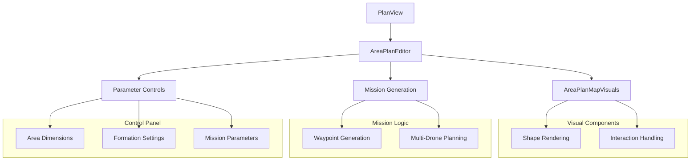
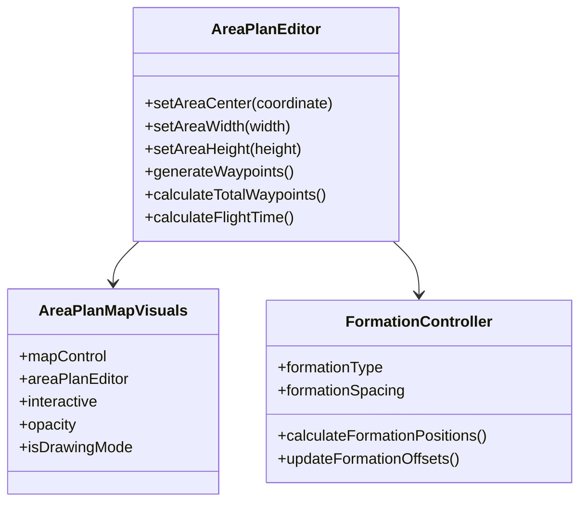
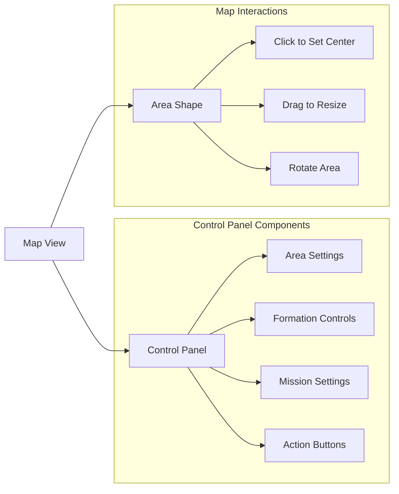
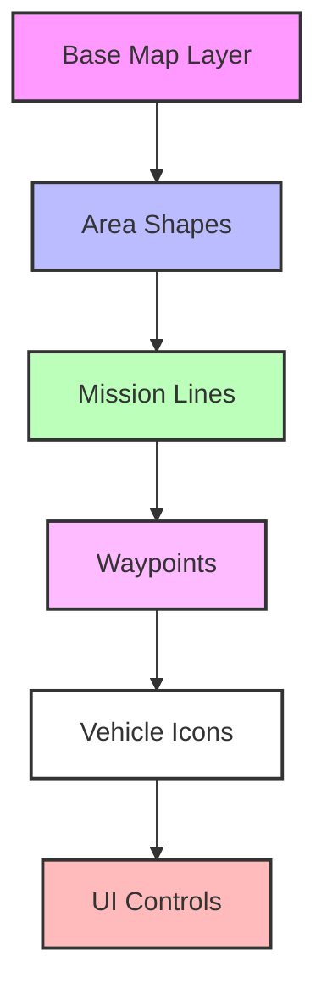
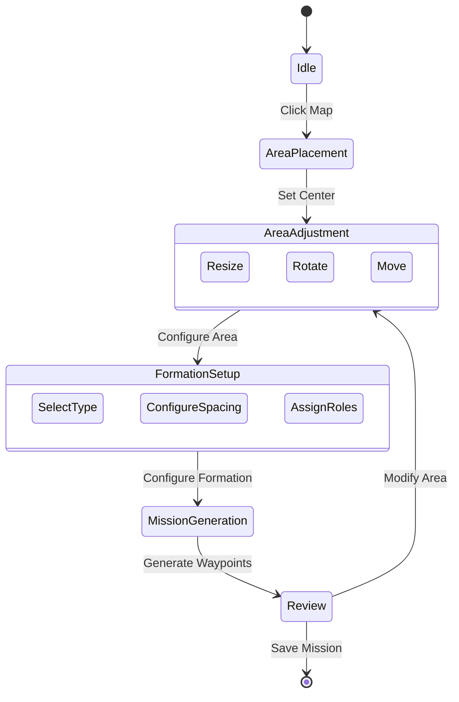

# Area Plan Editor Documentation

## Overview
The Area Plan Editor is a specialized component in QGroundControl that enables users to define and manipulate area-based mission planning. It provides tools for creating, editing, and managing area shapes for various mission types such as surveys, geofencing, and multi-drone operations.

## Architecture

## Component Structure

## UI Layout

## Key Features

### 1. Area Definition
- Center point selection via map click
- Width and height adjustment
- Rotation control
- Real-time visual feedback

### 2. Formation Control
- Multiple formation types:
  - V Formation
  - Line Formation
  - Circle Formation
  - Grid Formation
- Configurable spacing
- Dynamic vehicle role assignment

### 3. Mission Parameters
- Altitude settings
- Speed control
- Entry/exit point configuration
- RTL (Return to Launch) options

### 4. Multi-Drone Support
- Drone count configuration
- Altitude band settings
- Time offset between drones
- Formation transition handling

## Z-Order Hierarchy

## State Management

## Integration Points

### 1. Mission Controller Integration
- Waypoint generation
- Mission validation
- Vehicle command generation

### 2. Vehicle Manager Integration
- Multi-vehicle support
- Formation management
- Mission upload/download

### 3. UI Integration
- Map visualization
- Parameter controls
- Status feedback

## Usage Examples

### Basic Area Planning
1. Switch to Area Plan tab
2. Click on map to set area center
3. Adjust width/height using controls
4. Configure formation parameters
5. Generate and verify mission

### Multi-Drone Operations
1. Set drone count
2. Configure altitude bands
3. Select formation type
4. Set spacing parameters
5. Generate per-drone missions

## Best Practices

1. **Area Definition**
   - Start with a clear area boundary
   - Consider vehicle capabilities when sizing
   - Account for obstacles and restricted zones

2. **Formation Planning**
   - Match formation to mission requirements
   - Ensure adequate spacing for safety
   - Consider wind effects on formation

3. **Mission Generation**
   - Validate waypoint count
   - Check flight times
   - Verify altitude separations

## Error Handling

1. **Input Validation**
   - Area dimensions within limits
   - Valid coordinate ranges
   - Reasonable formation parameters

2. **Mission Validation**
   - Waypoint count checks
   - Flight path verification
   - Vehicle capability matching

3. **User Feedback**
   - Clear error messages
   - Visual indicators
   - Status updates

## Performance Considerations

1. **Map Rendering**
   - Efficient shape updates
   - Smooth interaction handling
   - Proper z-ordering

2. **Computation**
   - Optimized waypoint generation
   - Efficient formation calculations
   - Background processing for heavy operations

3. **Memory Management**
   - Clean resource handling
   - Proper cleanup on tab switches
   - Efficient data structures
